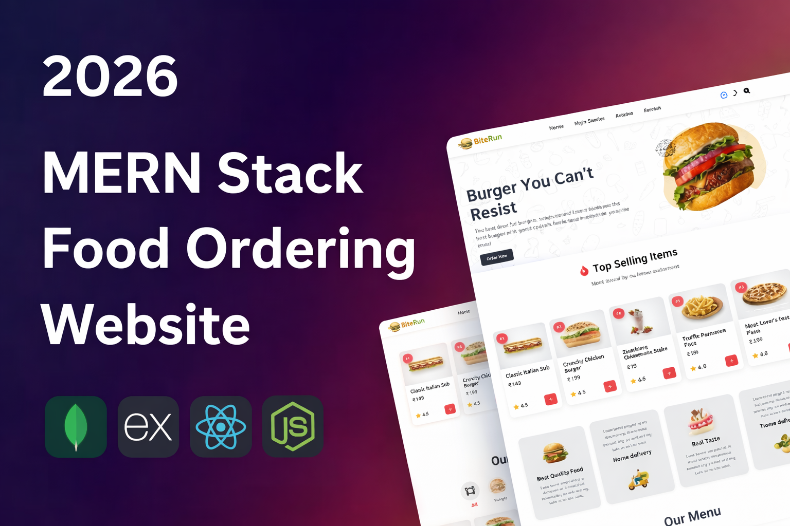

# Full-Stack MERN Food Ordering Application

A premium, full-stack food ordering platform built with the MERN stack (MongoDB, Express, React, Node.js). This application features a seamless customer experience for browsing and ordering food, complemented by a powerful administrative dashboard for managing the restaurant's operations.



## 🚀 Live Demo
Check out the live website: [Preview Link Here](https://food-order-amber-eight.vercel.app/)

---

## ✨ Key Features

### 👤 Customer Features
*   **Dynamic Menu Exploration:** Browse food items by categories with real-time search functionality.
*   **User Authentication:** Secure registration and login system with persistent sessions.
*   **Shopping Cart:** Add/remove items and manage quantities with automatic total calculations.
*   **Secure Checkout:** Streamlined ordering process with support for various payment methods.
*   **Order History:** Track previous orders and their current status.
*   **Reviews & Ratings:** Share feedback and rate menu items.
*   **Contact & Notifications:** Dedicated form for user inquiries and feedback.

### 🛡️ Admin Dashboard
*   **Comprehensive Analytics:** Data-driven dashboard with statistics on revenue, orders, and customer growth.
*   **Inventory Management:** Full CRUD operations for menu items, including categories and stock status.
*   **Order Management:** Real-time tracking and status updates (Placed, Delivered, Cancelled).
*   **Hero Section Control:** Customize the homepage hero section directly from the dashboard.
*   **Security:** Protected admin routes with specialized middleware.

---

## 🛠️ Tech Stack

### Frontend
*   **React.js** (Vite)
*   **React Router Dom** (Navigation)
*   **Context API** (State Management)
*   **React Hot Toast** (Notifications)
*   **Vanilla CSS** (Custom Styling)

### Backend
*   **Node.js & Express**
*   **MongoDB & Mongoose** (Database)
*   **Cloudinary** (Image Hosting)
*   **JWT & Cookies** (Authentication)
*   **Multer** (File Upload Handling)

---

## ⚙️ Installation & Setup

### 1. Clone the repository
```bash
git clone https://github.com/YOUR_USERNAME/YOUR_REPO_NAME.git
cd food-ordering
```

### 2. Backend Setup
```bash
cd server
npm install
```
Create a `.env` file in the `server` directory and add your credentials:
*   `MONGODB_URI`
*   `JWT_SECRET`
*   `CLOUDINARY_CLOUD_NAME`
*   `CLOUDINARY_API_KEY`
*   `CLOUDINARY_API_SECRET`
*   `SELLER_EMAIL` (for admin login)
*   `SELLER_PASSWORD`

### 3. Frontend Setup
```bash
cd ../client
npm install
```
Create a `.env` file in the `client` directory:
*   `VITE_BACKEND_URL`

### 4. Run Locally
**Server:** `npm run dev` (in /server)  
**Client:** `npm run dev` (in /client)

---

## 🌍 Deployment
This project is configured for easy deployment on **Vercel**. 
*   The `client` and `server` directories both contain `vercel.json` configurations.
*   Ensure that you set all environment variables in the Vercel dashboard during deployment.

---

## 📄 License
This project is licensed under the MIT License.
